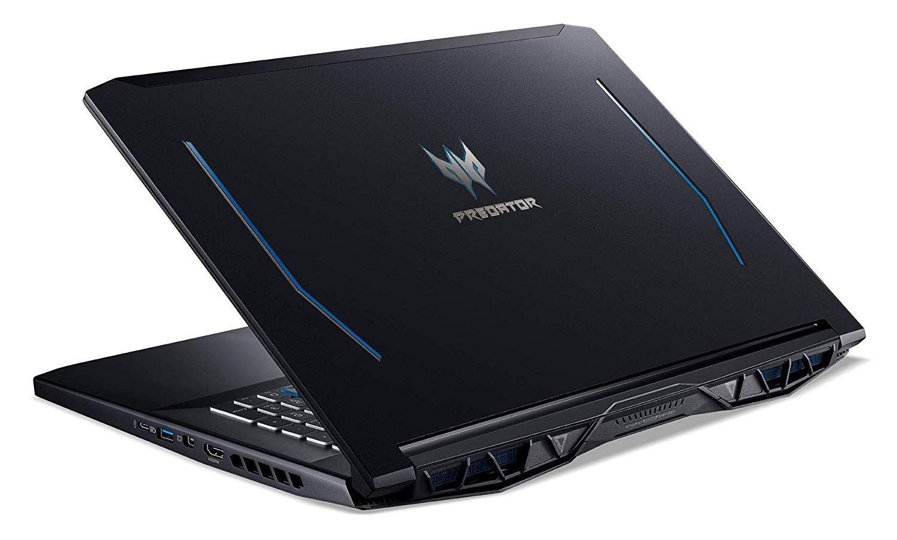
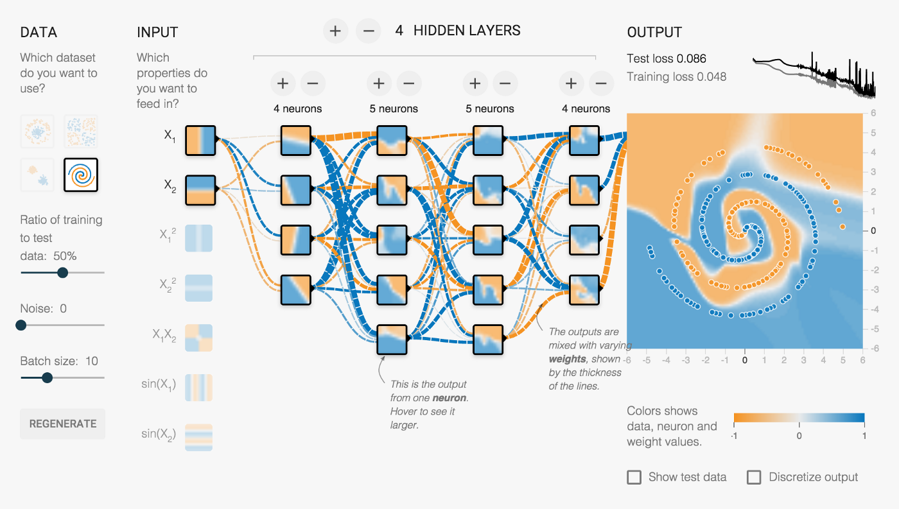
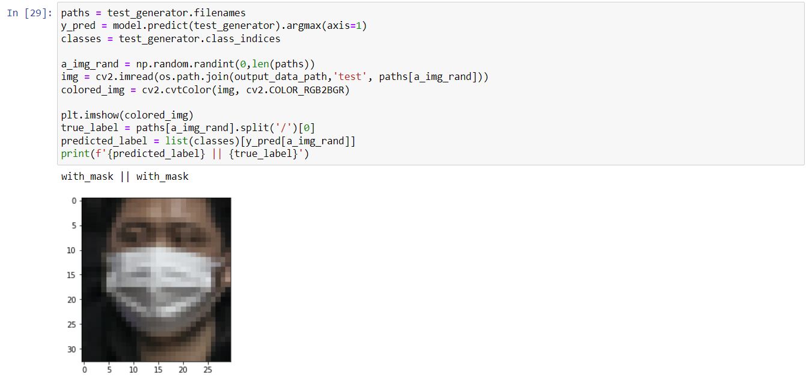

# PROJECT OVERVIEW

## C. IMPLEMENTING THE PROJECT PLAN
### Deliverables:
Hardware Requirement:

Our crew utilises an Acer Predator Helios 300 laptop with an Intel Core i7 processor and 16GB of RAM to carry out our project.

#### Software Requirement:

Our team implemented the code for the deep learning module in the programme using Jupyter Notebook, a web-based interactive computing platform, in order to recognise and analyse people who will be entering the Lotus mall. To train and test the given data, we additionally use the face mask detection dataset from Kaggle. More data may be supplied for testing and training so that our system operates more accurately.

#### Intelligent System Architecture:
TensorFlow, a machine learning and artificial intelligence software library, is the foundation of our system. We focused on deep neural network training utilising the TensorFlow framework for our research.

TensorFlow architecture:

#### Outcomes of the system
In the result section, we will choose a random image and, using the accuracy of our model, forecast whether or not the subject is wearing a mask. 
Below is the outcome:

### Tasks and Estimated Costs

| Task |  Estimated Costs | Notes |
|-----|----|----|
|   Server Maintenance         |$24000                         |  Monthly Cloud Server      |      
|   Construction supervision   |$30000                         | Supervision on the project | 
|   Cultural resources         |$72000                         |  Investigate and evaluate undertaking                                                 |                              |
|   Equipment and equipment use|$800                           | Equipment preparation and setup                                                       |                              |
|   Project signs              |$400                           |  Installation of project signs     |                            |
|   TOTAL                      |$127200                        |  Estimated     |                              |

### Milestone Chart
#### Microsoft Project:

   
##### Next: [Project Execution](D-PROJECT_EXECUTION.md)
