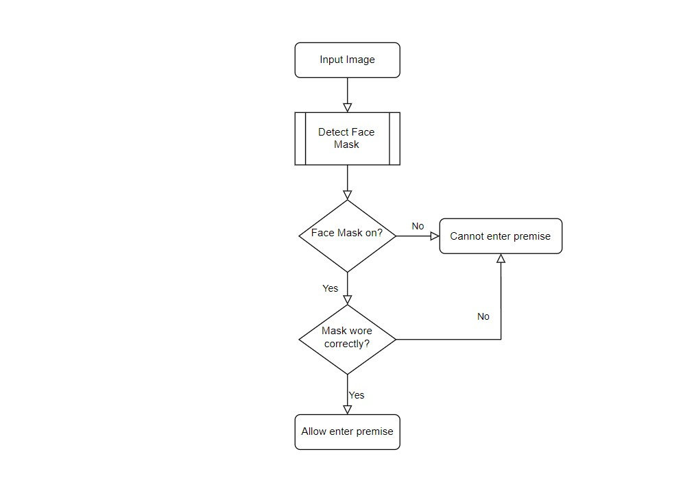
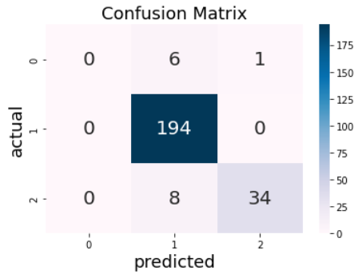

## D. EXECUTING THE PROJECT

### Project Design

Flowchart:
Example of implementing Face Mask Detection in Lotus's Supermarket

### Project Coding
#### Description and Implementation 
For this system, we implemented the codings using Python programming language inside Jupyter Notebook. The full codings can refer to: [Python Coding](assets/face-mask.ipynb)
After importing all the necessaries libraries and packages, input data are inserted. The source of test and training datasets that we used are from [Kaggle](https://www.kaggle.com/datasets/andrewmvd/face-mask-detection). 

In this project, the system will identify three types of conditions which are with mask, without mask, or mask wear incorrectly. Then, the training, testing, and validation data are calculated to find out the prediction results of each dataset. The predictions calculation include loss, accuracy, recall, precision, auc, validation loss, validation accuracy, validation recall, validation precisio, and validation auc. As a result, the predicted label and true label are displayed with the image that is being predicted. The confusion matrix of the actual and predicted evaluation is also being shown as follows:

   
##### Next: [Project Closing](E. PROJECT CLOSING.md)
