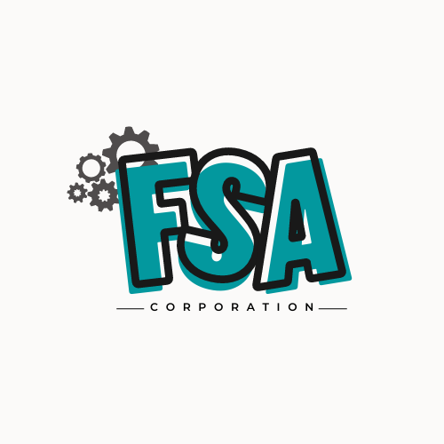

# ABOUT FNS Corporation 

A group of 3 eager UTeM students that are interested in AI founded this company. They are passionate about AI software and products and want to make AI more widely available.

Based in Malacca,Malaysia. 

## OUR MISSION
Artificial intelligence that emphasizes authentic human connections.

## Innovation
We’re putting modern AI into the hands of businesses – so they can do new, awesome things.

## OUR TEAM
**CHIEF EXECUTIVE OFFICIAL (CEO)**

**NUR FAEZAH BINTI ABDUL RAUF**

Responsibility:
1. Control the workforce and personnel of the corporation.
2. Making significant business choices
3. Control and distribute the company's resources
4. Ensure the job is completed by the deadline.

 

**CHIEF OPERATING OFFICIAL (COO)**

**MUHAMMAD SYAHIR BIN MOHD RASHIDI**

Responsibility:
1. Describe any project's status and progress directly to the CEO.
2. Identify potential risks and threats to the business.
3. Encourages the CEO to attend community activities and interact with more people
4. Keep the company's other employees in the public eye.

 

**CHIEF TECHNOLOGY OFFICIAL (CTO)**

**MUHAMMAD ANASS BIN SULAIMAN**

Responsiblity:
1. Choose the necessary vehicle plate recognition technology.
2. Communicate with all levels to ensure that the ideas and project can be fulfilled. 
3. Develop the strategy for the organisation to provide a safe and secure development and production environment.
4. Manage the technical team that the organisation has on hand and divide the tasks according to their areas of competence.

 
